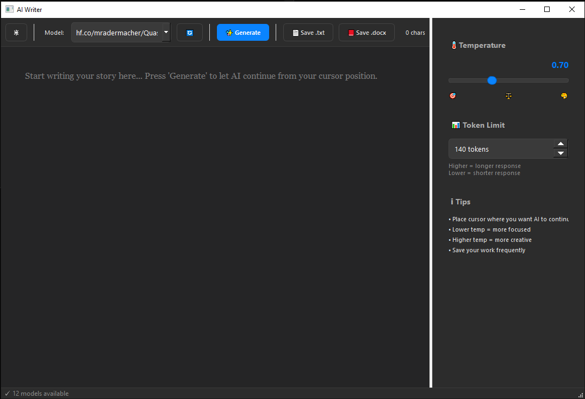

# AI Writer 🖋️


A sleek desktop application for AI-assisted writing powered by **Ollama** and built with **PyQt5**. Let your local LLM continue your stories, articles, or documents seamlessly.

[](https://www.python.org)
[](https://www.riverbankcomputing.com/software/pyqt/)
[](https://ollama.ai)
[](LICENSE)

---

## ✨ Features

- **🤖 AI Text Completion** - Continue your writing with local LLM models via Ollama
- **🎨 Light/Dark Theme** - Toggle between beautiful light and dark modes
- **🌡️ Temperature Control** - Adjust creativity vs. focus (0.0 - 2.0)
- **📊 Token Limit** - Control response length (10 - 2000 tokens)
- **📝 Model Selection** - Choose from all your installed Ollama models
- **💾 Multiple Export Formats** - Save as .txt or .docx (Word)
- **🖥️ Modern UI** - Clean, responsive interface with sidebar controls
- **⚙️ Configuration Management** - Persistent settings and preferences
- **🧪 Comprehensive Testing** - Full test suite for reliability

---

## 📋 Requirements

### System Requirements
- **Python 3.11+**
- **Ollama** installed and running locally
- **Operating System**: Windows, macOS, or Linux

### Python Dependencies
All dependencies are automatically installed with the package.

---

## 🚀 Quick Start

### 1. Install Ollama

First, ensure Ollama is installed and running on your system:

**macOS/Linux:**
```bash
curl -fsSL https://ollama.ai/install.sh | sh
ollama serve
ollama pull llama2  # Install a model
```

**Windows:**
Download from [ollama.ai](https://ollama.ai) and follow the installation guide.

### 2. Install AI Writer

```bash
pip install ai-writer
```

### 3. Launch the Application

```bash
ai-writer
```

That's it! The application will automatically detect your Ollama models and you can start writing immediately.

---

## 🏗️ Development

### Development Setup

1. **Clone and set up the development environment:**
   ```bash
   git clone https://github.com/Laszlobeer/AI-Writer.git
   cd AI-Writer
   uv sync --dev
   ```

2. **Run the application in development mode:**
   ```bash
   uv run python -m ai_writer.main
   ```

### Project Structure

```
ai-writer/
├── src/ai_writer/          # Main application package
│   ├── config/             # Configuration management
│   ├── core/               # Core business logic
│   ├── ui/                 # User interface components
│   └── utils/              # Utility functions
├── tests/                  # Comprehensive test suite
├── docs/                   # Documentation
├── scripts/                # Build and development scripts
└── assets/                 # Static assets
```

### Code Quality

This project maintains high code quality standards:

- **pytest** for comprehensive testing
- **black** for code formatting
- **ruff** for linting
- **mypy** for type checking
- **pre-commit** hooks for automated quality checks

Run quality checks:
```bash
uv run pytest tests/                      # Run tests
uv run black src/ tests/ scripts/         # Format code
uv run ruff check src/ tests/ --fix       # Lint code
uv run mypy src/ai_writer/               # Type checking
```

---

## 📖 Documentation

- **[User Guide](docs/user_guide.md)** - Complete usage instructions
- **[Development Guide](docs/development.md)** - Development setup and architecture
- **[Changelog](CHANGELOG.md)** - Version history and changes

---

## 🔧 Configuration

AI Writer automatically saves your preferences to:
- **Windows**: `%APPDATA%\AI-Writer\settings.json`
- **macOS/Linux**: `~/.config/ai-writer/settings.json`

All settings are configurable through the UI and persist between sessions.

---

## 🛠️ Troubleshooting

### Common Issues

**"Cannot connect to Ollama":**
- Ensure Ollama is running: `ollama serve`
- Check if Ollama is on the correct port (default: 11434)

**"No models found":**
- Install a model: `ollama pull llama2`
- Click the refresh button in the application

**Performance issues:**
- Use smaller models for faster generation
- Reduce token limit if running out of memory
- Ensure sufficient system resources

For more detailed troubleshooting, see the [User Guide](docs/user_guide.md).

---

## 🤝 Contributing

We welcome contributions! Please see our contributing guidelines:

1. Fork the repository
2. Create a feature branch: `git checkout -b feature/amazing-feature`  
3. Make your changes and add tests
4. Run the test suite: `pytest tests/`
5. Submit a pull request

### Development

- Follow the [Development Guide](docs/development.md) for setup
- Maintain test coverage for new features
- Follow the established code style (enforced by pre-commit hooks)
- Update documentation as needed

---

## 📜 License

This project is licensed under the MIT License - see the [LICENSE](LICENSE) file for details.

---

## 🙏 Acknowledgments

- [Ollama](https://ollama.ai) for providing the local LLM infrastructure
- [PyQt5](https://www.riverbankcomputing.com/software/pyqt/) for the desktop UI framework
- The open-source community for the excellent development tools

---

## 🚀 What's New in v0.1.0

This version represents a complete restructuring of the AI Writer project:

✅ **Modular Architecture** - Separated into logical, testable components  
✅ **Configuration Management** - Centralized, persistent settings  
✅ **Comprehensive Testing** - Full test suite with pytest  
✅ **Modern Packaging** - Proper Python packaging with entry points  
✅ **Development Tooling** - Code quality tools and pre-commit hooks  
✅ **Documentation** - Complete user and development guides  
✅ **Type Safety** - Type hints throughout the codebase

See the full [Changelog](CHANGELOG.md) for detailed changes.


**Windows/macOS:**
```bash
# Download from https://ollama.ai
# Then pull a model
ollama pull thewindmom/hermes-3-llama-3.1-8b
```

**Linux:**
```bash
curl -fsSL https://ollama.ai/install.sh | sh
ollama pull thewindmom/hermes-3-llama-3.1-8b
```

### 2. Clone the Repository

```bash
git clone [https://github.com/yourusername/ai-writer.git](https://github.com/Laszlobeer/AI-Writer.git)
cd ai-writer
```

### 3. Create Virtual Environment (Recommended)

```bash
python -m venv venv

# Windows
venv\Scripts\activate

# macOS/Linux
source venv/bin/activate
```

### 4. Install Dependencies

```bash
pip install -r requirements.txt
```

Or install manually:
```bash
pip install PyQt5 requests python-docx
```

---

## 🎯 Usage

### Starting the Application

```bash
python ai writer.py
```

### Basic Workflow

1. **Select a Model** - Click the model dropdown and choose an installed Ollama model
2. **Write Your Text** - Start typing in the editor
3. **Click Generate** - Press the ✨ Generate button or use keyboard shortcut
4. **Save Your Work** - Export as .txt or .docx

### Controls

| Control | Description |
|---------|-------------|
| 🌙/☀️ | Toggle Light/Dark theme |
| 🔄 | Refresh available models |
| ✨ Generate | Trigger AI completion |
| 📄 Save .txt | Export as text file |
| 📕 Save .docx | Export as Word document |
| 🌡️ Temperature | Adjust creativity (left=focused, right=creative) |
| 📊 Token Limit | Set maximum response length |

---

## ⚙️ Configuration

### Default Settings

| Setting | Default Value | Description |
|---------|--------------|-------------|
| Temperature | 0.7 | Balance between creativity and coherence |
| Token Limit | 2000 | Maximum tokens in AI response |
| Ollama URL | http://localhost:11434 | Local Ollama server endpoint |

### Customizing Settings

You can modify default values in the source code (`ai_writer.py`):

```python
# In ai_writer.py
OLLAMA_URL = "http://localhost:11434"
DEFAULT_TOKEN_LIMIT = 140
DEFAULT_TEMPERATURE = 0.7
```

### Temperature Guide

- **0.0 - 0.5** 🎯 Focused, deterministic output
- **0.5 - 1.0** ⚖️ Balanced creativity and coherence
- **1.0 - 2.0** 🎨 Highly creative, unpredictable output


---

## 🖼️ Screenshots

### Light Mode


### Dark Mode



---

## 🔧 Troubleshooting

### Ollama Connection Error
```
Cannot connect to Ollama. Is it running?
```
**Solution:** Ensure Ollama service is running:
```bash
ollama serve
```

### No Models Found
```
No models available
```
**Solution:** Pull a model:
```bash
ollama run thewindmom/hermes-3-llama-3.1-8b
```

### python-docx Not Available
```
install python-docx for .docx
```
**Solution:** Install the package:
```bash
pip install python-docx
```

---

## 📄 License

This project is licensed under the MIT License - see the [LICENSE](LICENSE) file for details.

---

## 🙏 Acknowledgments

- [Ollama](https://ollama.ai) - Local LLM infrastructure
- [PyQt5](https://www.riverbankcomputing.com/software/pyqt/) - GUI framework

---


